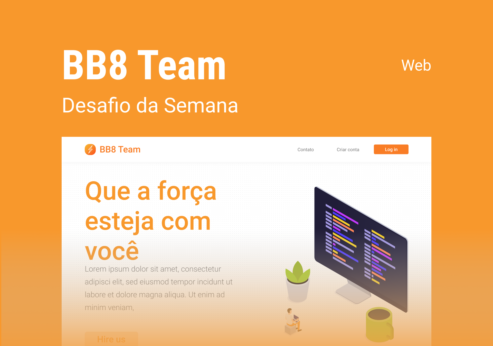

<h1 align="center">
    
</h1>

<h3 align="center">
  <a href="#-tecnologias">Tecnologias</a>&nbsp;&nbsp;&nbsp;|&nbsp;&nbsp;&nbsp;
  <a href="#-projeto">Projeto</a>&nbsp;&nbsp;&nbsp;|&nbsp;&nbsp;&nbsp;
  <a href="#-layout">Layout</a>&nbsp;&nbsp;&nbsp;|&nbsp;&nbsp;&nbsp;
</h3>

 

  

## 🚀 Tecnologias

Esse projeto foi desenvolvido com as seguintes tecnologias:

- HTML
- CSS
- JavaScript
- Bootstrap v5

## 💻 Projeto

O BB8-Team é um Projeto desenvolvido no desafio da semana da Comunidade da Rafaella Ballerini onde a Tecnologia escolhida foi o Bootstrap.

## 🔖 Layout

Você pode visualizar o layout do projeto através [desse link](https://www.figma.com/file/87P2bmC0xNGOaRWqvMFeR3/BB8-Team-UI-Copy/duplicate ). É necessário ter conta no [Figma](https://figma.com) para acessá-lo.